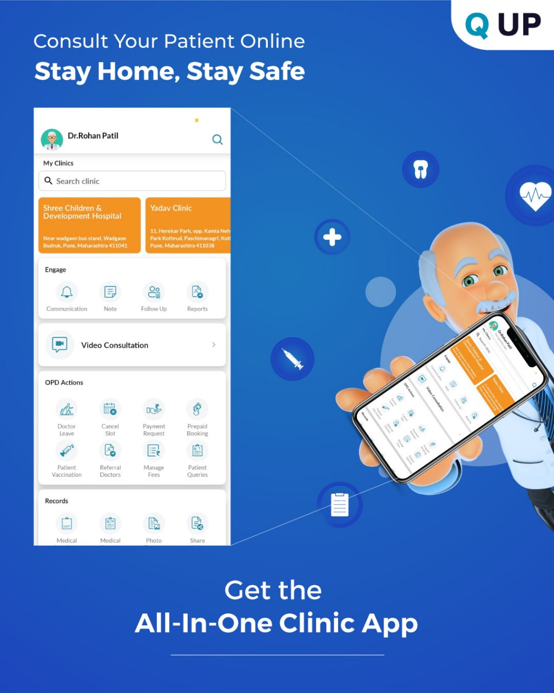

# Q UP Plus App Documentation

  

## Overview

Q UP Plus is a B2B doctor consultation app developed to empower clinics and healthcare professionals with tools for digital practice. It enables appointment scheduling, patient communication, report sharing, and more — all from a mobile device.

This documentation provides a detailed guide on each feature of the app and how doctors can use it to run a self-reliant, patient-friendly clinic.

---

## Target Users

- Doctors managing single or multiple clinics
- Clinic assistants
- Healthcare providers who want to upgrade their clinical practice

---

## Main Features Covered

- Patient Query
- Manage Fees
- Share GYAN
- Communication & Follow-up
- Cancel Slot / Leave
- HealthBox (Vitals, Tracker, Reports)

<blockquote>
  📌 <strong>Note:</strong> This repository was created in <strong>July 2025</strong> to showcase previously written app documentation on a public platform (GitHub).
</blockquote>
