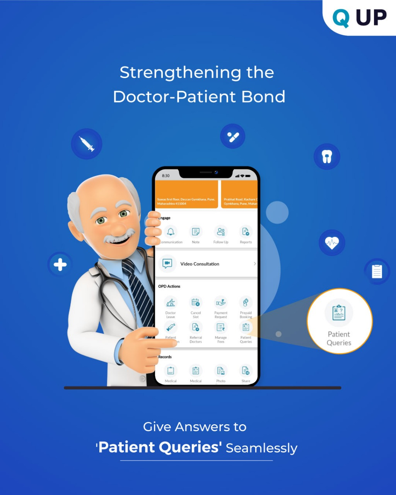

# Patient Query

  

<em>Figure: Patient Query Interface</em>

## What is Patient Query?

This feature allows doctors to receive, view, and respond to patient questions submitted through the app. It helps maintain ongoing communication outside scheduled consultations.

---

## How It Works

1. Tap on the `Pt Query` option under the "Engage" section.
2. You’ll see a list of questions submitted by patients.
3. Click on a question to view full details.
4. Type your response in the Answer box.
5. Tap **Send** — the patient will be notified.

---

## Use Case

Dr. Aishwarya receives a question:  
“Q. How to start a healthy eating habit?”  
She replies directly from the app. The patient feels guided without needing a visit.

---

## Benefits

- Saves clinic time
- Strengthens doctor-patient trust
- Keeps minor queries from turning into serious concerns

