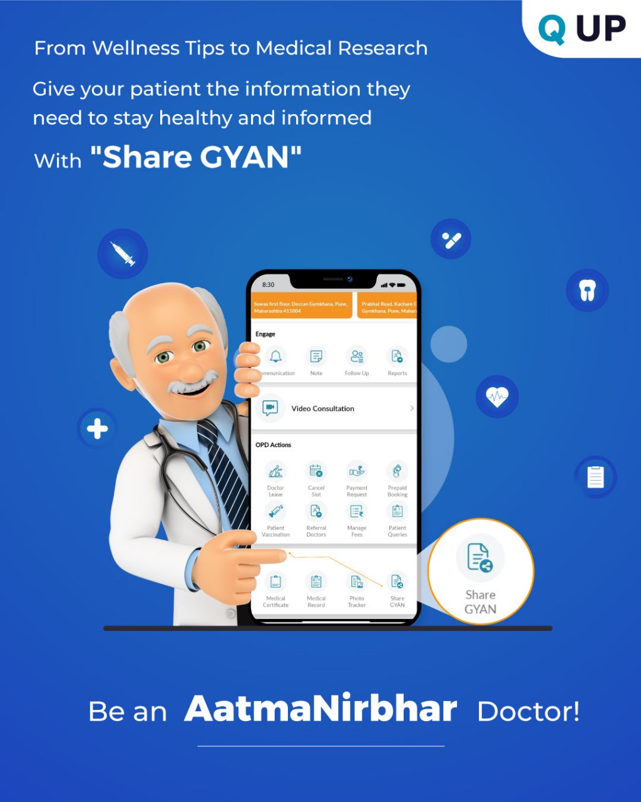

# Share GYAN

  

<em>Figure: Share Gyan feature screen</em>

## What is Share GYAN?

**Share GYAN** allows doctors to easily share health tips, guidance, or personal notes with patients directly through the Q UP app — without a consultation.

This helps you build ongoing trust and patient education, while maintaining your presence beyond appointments.

---

## How It Works

1. Open the Q UP app and go to the **Engage** section.
2. Tap on **Share GYAN**.
3. Type your message, tip, or health guidance in the text box.
4. Tap **Share** — the message gets delivered to your patients’ app directly.

---

## Examples of GYAN You Can Share

- “Drink 3–4 litres of water daily in summer.”
- “Never skip your thyroid medication.”
- “Walk at least 30 minutes a day for better heart health.”
- “Check your vitamin B12 and D levels if you're always tired.”

---

## Why Use It?

- 👨‍⚕️ Stay connected with patients  
- 💡 Educate and inspire healthier habits  
- 📲 No separate app needed  
- 🧠 Strengthen your positioning as a trusted doctor
