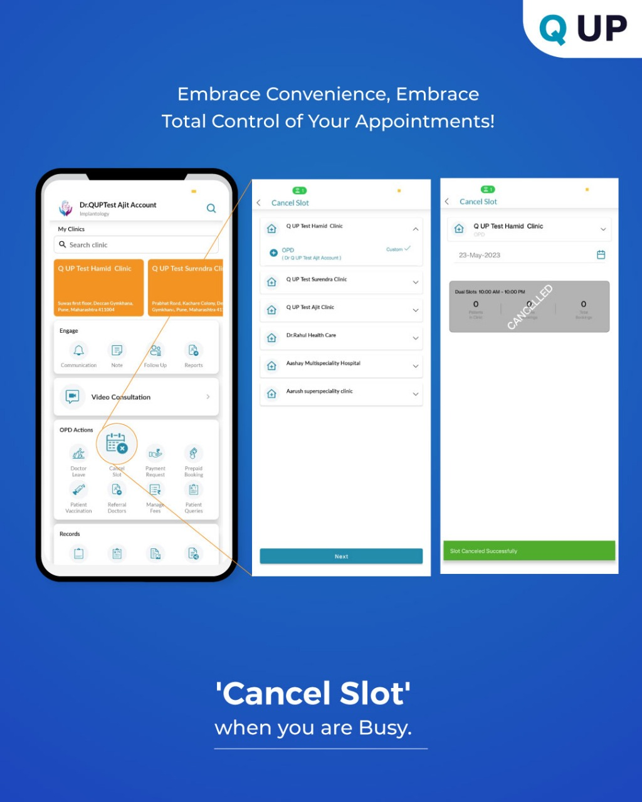

# Cancel Slot

  

<em>Figure: Cancel a Time Slot</em>

## What Is It?

The **Cancel Slot** feature lets doctors quickly cancel or adjust their OPD slots in case of emergencies, holidays, or changes in availability.

---

## How It Works

1. Tap on the **Calendar** icon from your dashboard.
2. Select the date you want to cancel or edit.
3. Choose the **slot** you'd like to cancel or reschedule.
4. Tap **Cancel Slot**.
5. Confirm the action — patients with appointments will be notified.

---

## Example Scenario

Dr. Nikhil has a conference on Friday. He cancels his evening OPD slot using the app, and all patients are auto-notified.

---

## Benefits

- 🧘 Reduces patient frustration
- 📆 Helps manage last-minute changes
- 🔔 Sends automatic updates to patients
- ✅ Maintains transparency and trust
