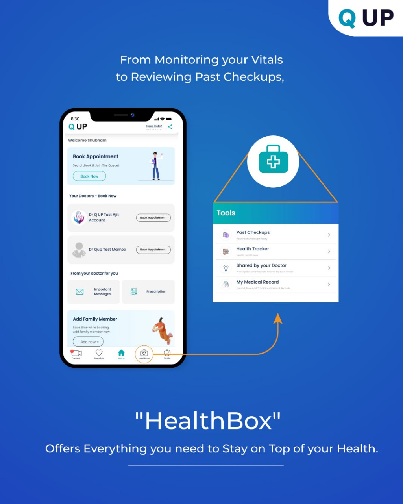

# HealthBox – Vitals Monitoring

  

<em>Figure: Vitals Entry in HealthBox</em>

## What Is HealthBox?

**HealthBox** lets doctors record and track basic patient vitals like:
- Weight
- Blood Pressure
- Blood Sugar
- Temperature
- SPO2
- Pulse Rate

This feature is useful during in-clinic consultations or online calls to monitor patient health trends.

---

## How It Works

1. Tap on **HealthBox** from the dashboard.
2. Select the patient profile.
3. Enter the relevant vitals.
4. Tap **Save** — the data is stored and visible to both doctor and patient.

---

## Use Case

During a follow-up, Dr. Meera updates a patient’s BP and sugar readings in HealthBox. This helps her track changes since the last visit.

---

## Benefits

- 📊 Centralised vitals record
- 👨‍⚕️ Easy follow-up management
- 🔁 Improves continuity of care
- 📱 Patients can also see the vitals in their app
